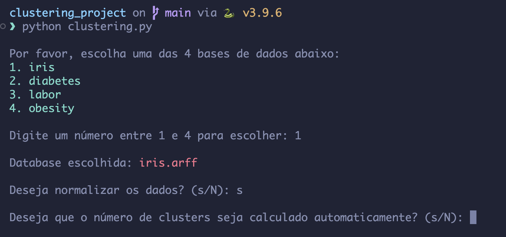
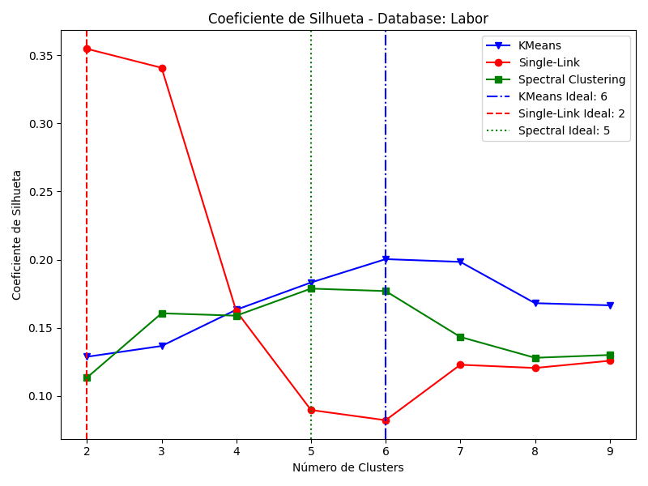
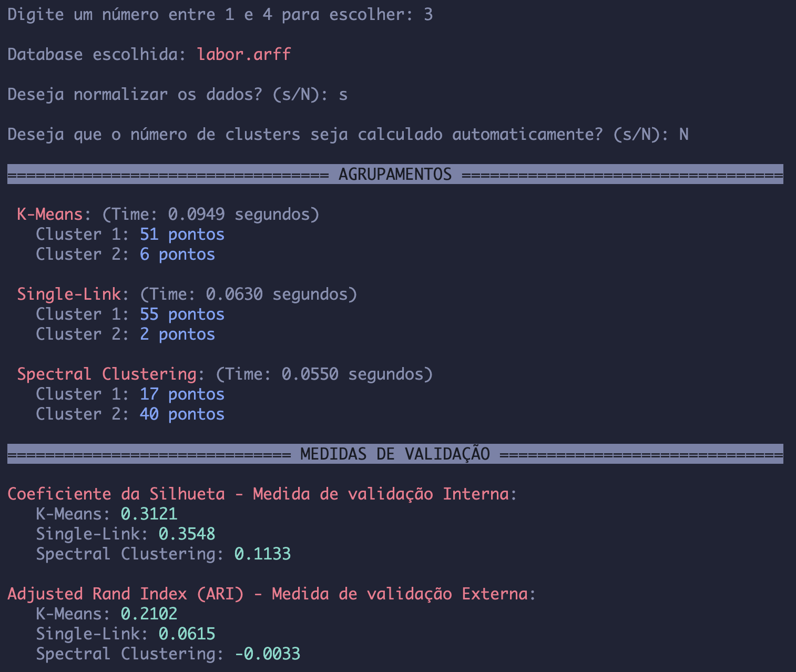
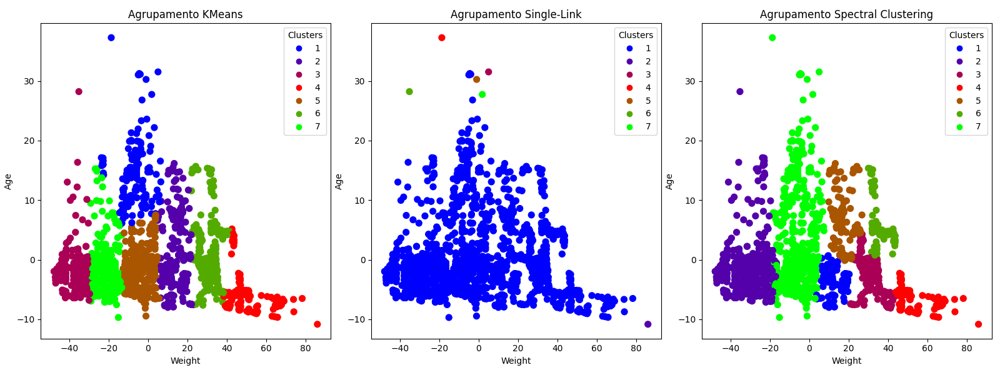

# Clustering Project - 
## Projeto de Comparação de Algoritmos de Clustering aplicados a diferentes Datasets
#### Trabalho para a disciplina de Tópicos Especiais de Inteligência Artificial: Agrupamento de Dados
####  - Universidade Federal de Uberlândia
#### FACOM: - Faculdade de Computação - 
#### Doutorado/Mestrado: Ciências da Computação

## Interactive Mode on Terminal

## Number of clusters estimated by the silhouette coefficient

## Clustering Summary Report

## Result Graph of Clustering

#### More coming soon
